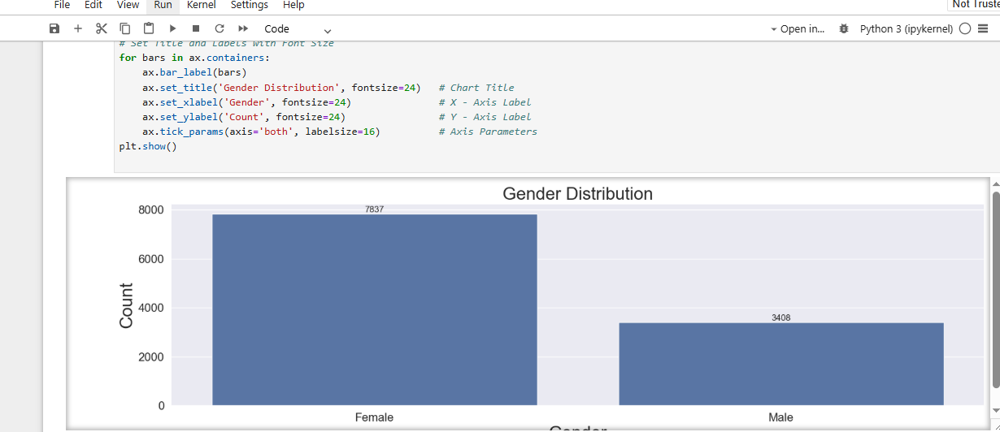
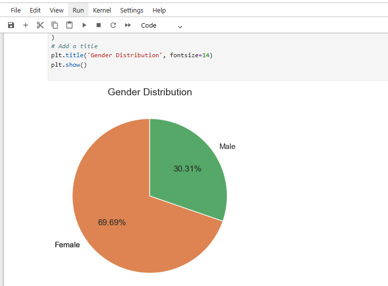
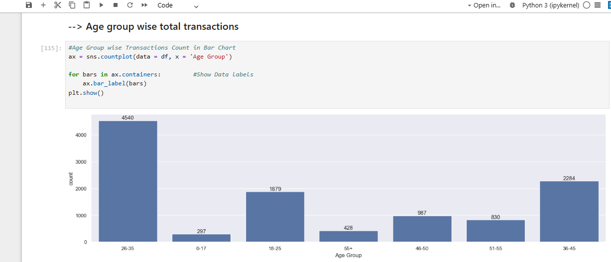
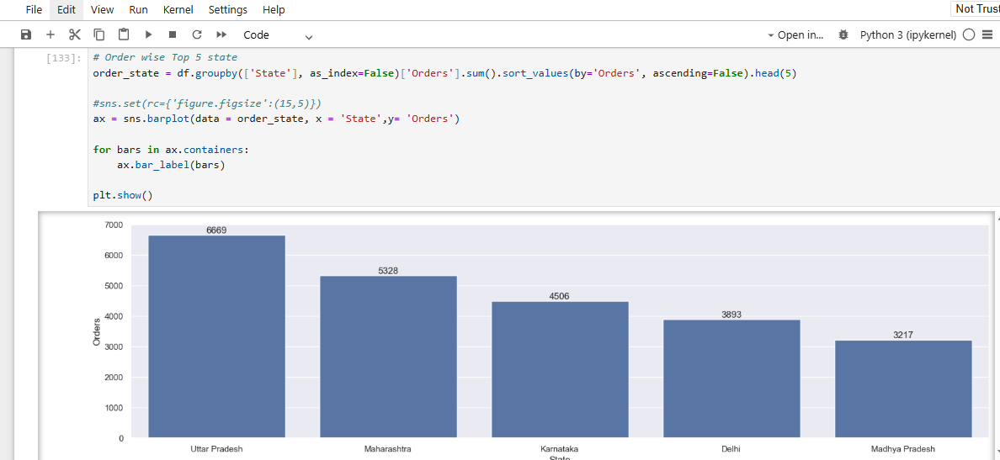
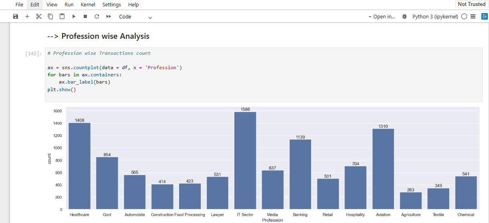
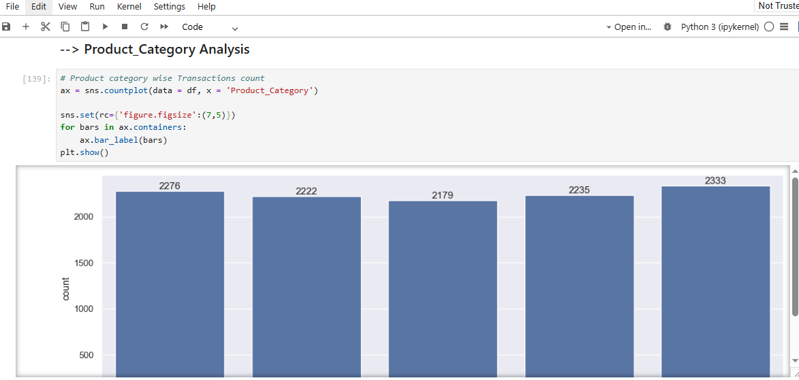
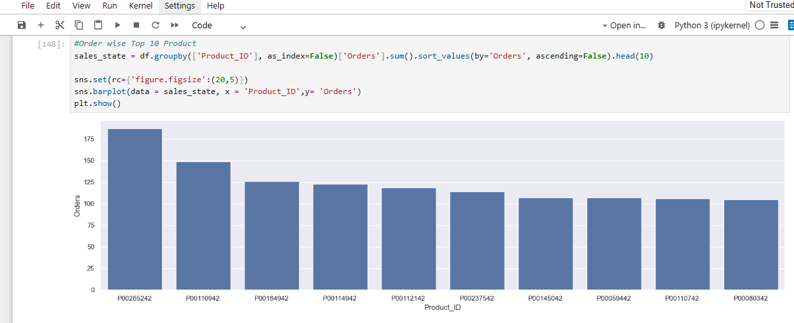

# 🛍️ Diwali Sales Data Analysis Using Python

## 📌 Project Overview

This project analyzes a Diwali Sales dataset using Python to uncover customer purchasing behavior, sales trends, and business insights. The project demonstrates an end-to-end data analysis workflow, including data cleaning, exploratory data analysis (EDA), and data visualization.

---

## 🎯 Project Objectives

- Clean and preprocess raw sales data.
- Analyze customer demographics.
- Identify top-performing states and product categories.
- Discover purchasing patterns during the Diwali season.
- Generate business insights using data visualization.

---

## 🛠️ Technologies Used

- Python
- Jupyter Notebook
- Pandas
- NumPy
- Matplotlib
- Seaborn

---

## 📂 Dataset

The project includes:

- **Sales_Data.csv** – Original dataset
- **Sales_Data_Cleaned.csv** – Cleaned dataset after preprocessing

---

## 🧹 Data Cleaning

The following preprocessing steps were performed:

- Removed duplicate records.
- Handled missing values.
- Removed unnecessary columns.
- Verified data types.
- Prepared the dataset for analysis.

---

## 📊 Exploratory Data Analysis (EDA)

The following analyses were performed:

- Gender Distribution
- Age Group Analysis
- State-wise Sales Analysis
- Profession-wise Analysis
- Product Category Analysis
- Top Selling Products

---

# 📸 Project Visualizations

## Gender Distribution



---

## Gender Distribution (Pie Chart)



---

## Age Group Analysis



---

## State-wise Sales Analysis



---

## Profession-wise Analysis



---

## Product Category Analysis



---

## Top Selling Products



---

# 💡 Key Business Insights

- Female customers contributed significantly more purchases than male customers.
- Customers aged **26–35 years** represented one of the largest purchasing groups.
- Uttar Pradesh, Maharashtra, and Karnataka generated the highest sales.
- Food and Clothing categories performed strongly during the Diwali season.
- Customer demographics can help businesses create targeted marketing campaigns and improve sales strategies.

---

# 📁 Repository Structure

```
Diwali-Sales-Analysis-Python/
│
├── Analysis on Sales Data.ipynb
├── Sales_Data.csv
├── Sales_Data_Cleaned.csv
├── requirements.txt
├── README.md
│
├── age_group_analysis.PNG
├── gender_distribution.PNG
├── gender_distribution_pie.PNG
├── products_category_analysis.PNG
├── profession_wise_analysis.PNG
├── state_analysis.PNG
└── top_products.PNG
```

---

## ▶️ How to Run the Project

1. Clone this repository.
2. Install the required libraries:

```bash
pip install -r requirements.txt
```

3. Open **Analysis on Sales Data.ipynb** in Jupyter Notebook.
4. Run all cells to reproduce the analysis and visualizations.

---

# 📌 Conclusion

This project demonstrates the complete data analysis process using Python, from cleaning raw data to generating actionable business insights. Through exploratory data analysis and visualization, the project highlights customer behavior, sales trends, and key business opportunities, showcasing practical skills required for entry-level data analyst roles.

---

## 👨‍💻 Author

**Abhishek Aryan**

Aspiring Data Analyst | SQL | Excel | Power BI | Python | Data Visualization
